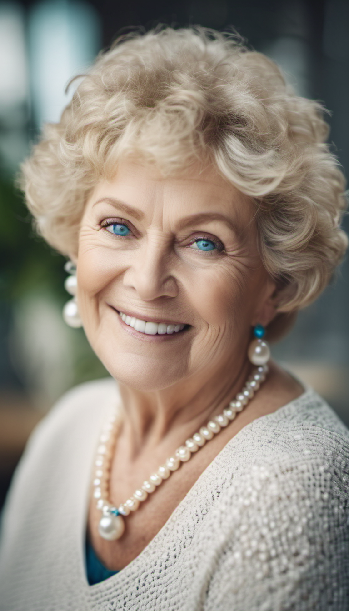

Auréa est une petite femme un peu ronde, elle est née en 1930 dans un petit village au sud de la ville de Québec. Ses cheveux ont toujours été blonds et coupés courts, mais depuis que le temps la rattrape elle les teint. Ses yeux bleus et elle est très coquette. Elle fut l’aînée de trois frères auxquels elle a tous survécu. Le deuxième, mourut à 80 ans en s’ouvrant la tête sur une descente de trottoir en sortant d’un bar. Il décéda à l’hôpital quelque heures après sa chute. Il saigna de l'intérieur jusqu'à en mourir. Le troisième, mourut dans les années 1970, il était dans la mi-trentaine. À peine marié, il succomba à la sclérose en plaques, ne laissant que sa femme derrière lui. [Hubert](https://cgermain97.github.io/Feu-de-Foret/hubert/), le dernier né de cette fratrie, mourut à l’âge de 83 ans. L'alcool fut le baume des maux dans cette famille. Jusqu'à sa mort, Auréa prit son verre de vodka straight au citron dès 10h le matin. Presque à tous les jours, le verre devint deux, trois ou se transforma en bouteille de vin lorsque midi sonnait.  

Auréa passa tout le début de sa vie adulte entre Montréal et [*Vilélie*](https://cgermain97.github.io/Feu-de-Foret/post1/), ce n'est qu'à la fin des années 80 qu'elle s'acheta une petite maison en forme de triangle et s'installa officiellement à *Vilélie*. Elle y resta jusqu'à la toute [fin](https://cgermain97.github.io/Feu-de-Foret/post3/).

*Auréa 65 ans*