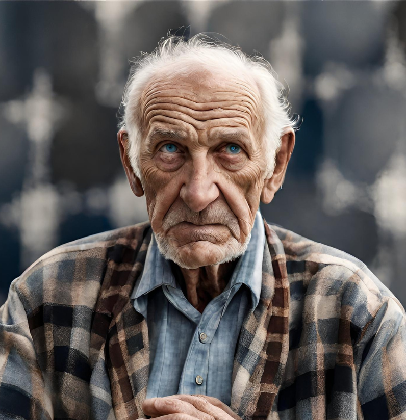

Dans le temps passé...

Hubert était un homme manuel, il adorait travailler de ses mains pour construire des meubles, un gazebo pour sa femme et même son propre [chalet](https://cgermain97.github.io/Feu-de-Foret/posts/chalet/). Il avait tant cloué, scié, martelé, manipulé que ses mains étaient telles des pattes d'ours.  

Il était grand, bien portant avec des lunettes d'aviateur. Pour lui, la famille était ce qu'il y avait de plus important. Il aimait ses enfants et sa femme, mais n'avait jamais appris à bien aimer. Dans sa famille, on affirmait que boire faisait disparaitre tous les maux. À une autre époque, on disait qu'il était bon vivant, c'étaient les soir où la maison se remplissait d'amis et collègues, tous rassemblés pour fêter la vie. Maintenant, les bouteilles cachées aux fonds des tiroirs ne célébraient plus rien. Il y avait bien les vendredis soir, chez [Auréa](https://cgermain97.github.io/Feu-de-Foret/posts/auréa/). Hubert y allait toujours sans [Philie](https://cgermain97.github.io/Feu-de-Foret/posts/philie/). Il affirmait que les vendredis soirs étaient soirs d'affaires. Philie ne fut jamais dupe, mais une soirée de plus, tranquille à la maison l'arrangeait bien. Dans le bureau d'Auréa, ils ouvraient une bouteille de vodka au citron pour trois. Ils s'asseyaient dans les grandes chaises autour de l'immense bureau en bois, sortaient les papiers et buvaient jusqu'à la dernière goutte. L'histoire ne dit pas combien de bouteilles ils finissaient par ouvrir. Ces soirées festives se terminaient toujours avec Hubert au volant de sa voiture. Il avait moins d'un mile à faire, pourquoi s'embêter?

Tout comme sa [sœur](https://cgermain97.github.io/Feu-de-Foret/posts/auréa/), Hubert avait les cheveux blonds, il souffrait de calvitie et tentait tant bien que mal de le cacher. Il avait aussi les yeux bleus, dont l'un aveugle à cause d'un malheur d'enfance.

*Hubert quelques années avant sa mort*