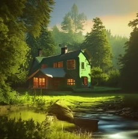

<audio controls="controls">
  <source type="audio/mp3" src="../audio/Les chutes.mp3"></source>
  
Your browser does not support the audio element.

</audio>

Le chalet vert est situé juste avant le pont qui traverse la rivière. Juste après le vieux bureau de poste, aux limites de [Vilélie](https://cgermain97.github.io/Feu-de-Foret/post1/).
Il fut construit par [Hubert](https://cgermain97.github.io/Feu-de-Foret/hubert/) dans les années 80, aidé de sa famille et ses amis. Comme son nom l'indique, les murs extérieurs sont faits en bois, peinturés vert bouteille. Tout juste à l'entrée, se trouve la cuisine, suivie d'une grande table à manger et du salon avec un foyer de pierre. Un corridor longe le mur du fond, où se situent trois chambres à coucher et une salle de bain. L'escalier sépare le corridor de la salle à manger et descend vers la cave. Cette dernière ne fut jamais finie, avec les années toutes sortes d'objets s'y sont ramassés, ainsi que les nombreux outils d'Hubert. Quelques temps après la fin de la construction, Hubert a agrandit le chalet, bâtissant une extension à chaque extrémité.

Dans la cuisine, une porte patio donne sur l'extérieur. Quand on sort, on arrive sur un immense balcon de bois qui fait face à la rivière. Le terrain est encore majoritairement boisé et s'étend à perte de vue. À descendre vers la rivière, on arrive sur d'énormes rochers où coulent des chutes d'eau. Les plus téméraires peuvent s'aventurer dans la forêt à droite, un ancien sentier laissé à l'abandon remonte le courant et débouche sur un second rocher plat, où il fait bon l'été de se tremper les pieds et se faire griller au soleil. 

Plusieurs années avant la construction du chalet, une scierie trônait sur les chutes de la rivière. Elle appartenait au second mari d'[Auréa](https://cgermain97.github.io/Feu-de-Foret/auréa/). Ce dernier vendit la terre à Hubert lorsqu'il n'en eut plus besoin. Encore aujourd’hui, sur l'immense rocher en bas du terrain, on peut y voir les traces de ce qu’était la scierie : trous dans la roche, murs de briques et tiges de métal. Une photo de la scierie trône toujours sur le mur des toilettes du chalet.

*Le chalet vert*

