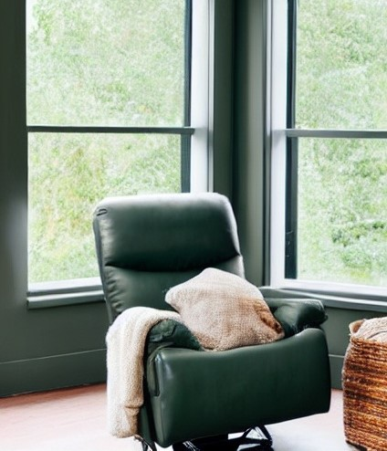

On retrouve encore à ce jour quatre églises à [Vilélie](https://cgermain97.github.io/Feu-de-Foret/post1/). Auréa fut fidèle à la petite église épiscopalienne toute blanche, située sur la rue William. Quand on entre dans le bâtiment derrière l'église, le soleil plombe à travers la grande fenêtre au bout du corridor et réchauffe la peau. Il se reflète aussi sur les murs de marbre blanc. Toutes bien alignées, de petites plaques dorées indiquent le nom de chaque occupant. Les rayons rendent vivant cet endroit, sinon froid et austère.

***

Quelques semaines avant le décès d'[Auréa](https://cgermain97.github.io/Feu-de-Foret/aur%C3%A9a/), elle fut
branchée à une bonbonne d’oxygène vingt-quatre heures sur vingt-quatre, son cœur lâchait petit à
petit. Sa maison était tellement grande, que le fil qui la reliait à sa bonbonne mesurait plusieurs mètres de long, elle pouvait ainsi se déplacer de sa chambre à la cuisine pour aller regarder les oiseaux et s’endormir devant la télévision trop forte. 
Le manque d'oxygène associé à son état de santé l'avait fortement affaiblie. Elle ne parlait presque plus, passait ses journées dans sa grande chaise verte forêt près de la fenêtre et se faisait dorloter par ses infirmières.

Comme son [frère](https://cgermain97.github.io/Feu-de-Foret/posts/hubert/), son plus grand désir fut de mourir chez elle. 

Le matin de sa mort, elle se réveilla à 7h, on pourrait aussi dire qu’elle ne
s’était pas réveillée comme elle ne dormait plus, hantée par l’idée de mourir. 

À 7h15, son infirmière l’assit dans sa chaise verte forêt, commença
à la changer, se retourna pour prendre un
chandail. C’est à ce moment que son cœur s’arrêta. Son corps fut agité de légers
soubresauts, le pacemaker placé près de son cœur essayant de le repartir, pour finalement ne
plus bouger.

À 7h16 c'était fini. 

[Auréa](https://cgermain97.github.io/Feu-de-Foret/aur%C3%A9a/) ne voulut pas se faire enterrer, alors
son corps fut brûlé, cette petite coquille
désormais vide, et finalement emmurée. Elle repose
aujourd'hui dans une urne, seule derrière le mur de marbre dans le bâtiment derrière la petite église blanche.

J'aimerais que le souvenir 
 
que l'on garde de moi soit heureux. 
 
J'aimerais laisser une lueur de sourires 
 
quand la vie sera finie. 
 
Je voudrais laisser un écho 
 
qui murmure doucement le long des chemins, 
 
des moments heureux, des moments de rire 
 
et des jours lumineux et ensoleillés. 
 
J'aimerais que les larmes de ceux qui sont en deuil 
 
sèchent devant le soleil. 
 
Des souvenirs heureux 
 
que je laisse quand la vie est finie.

*Afterglow, court poème par Helen Lowrie Marshall, traduction de l'autrice* 
 
*Texte retrouvé sur le signet funéraire d'Auréa*