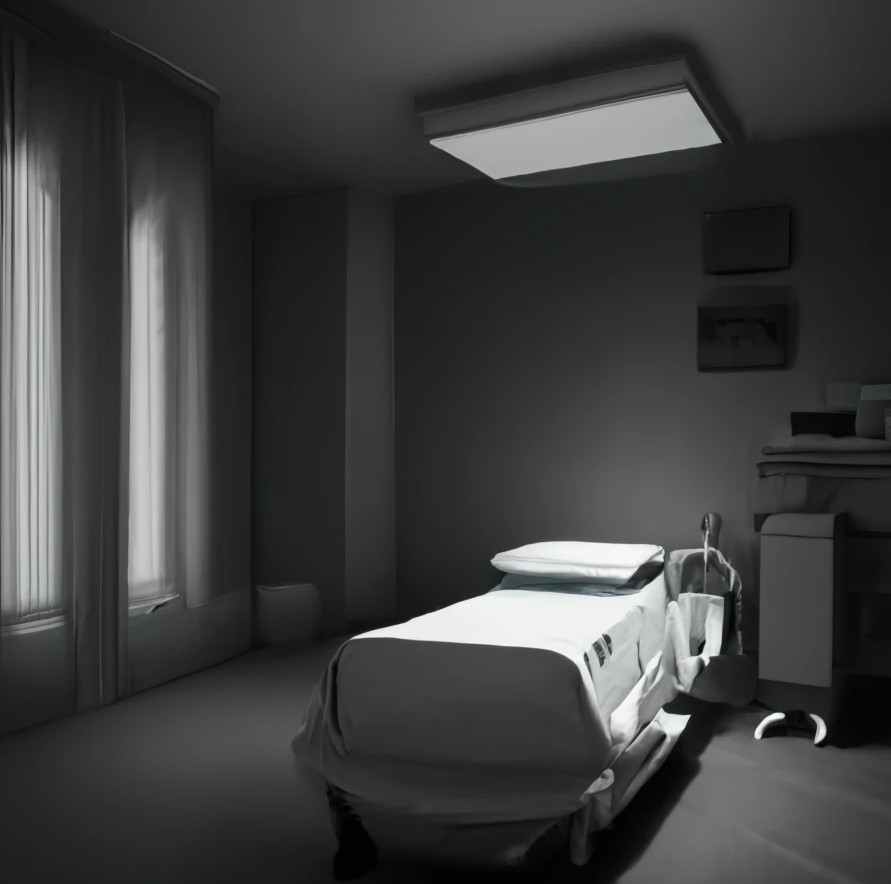

Cette image de [moi](https://cgermain97.github.io/Feu-de-Foret/posts/hubert/) s’éteindra.

Celle de mon corps [décharné](https://cgermain97.github.io/Feu-de-Foret/post2/) se reflétant dans leurs yeux.

Lorsqu’il ne restera plus que mes rides innombrables sur ma peau délavée, 
 
qui aura la couleur du parchemin taché de café

Lorsque mes os sailleront sous les draps, 
 
tels les monts de ma douleur

Lorsqu’il ne restera aucune lumière dans mes yeux rigides, 
 
qui refuseront de se fermer

Lorsque ma bouche dégarnie et béante,
 
laissera passer un dernier râle qui restera pour toujours inaudible

Lorsque mes organes me lâcheront un par un,
 
et qu’il ne restera que les battements

Lorsque ceux-ci s’espaceront 
 
de plus en plus 
 
et que dans leurs yeux,
 
nous compterons les secondes, 

puis les minutes qui s’écouleront, 

jusqu’à la dernière répétition.

