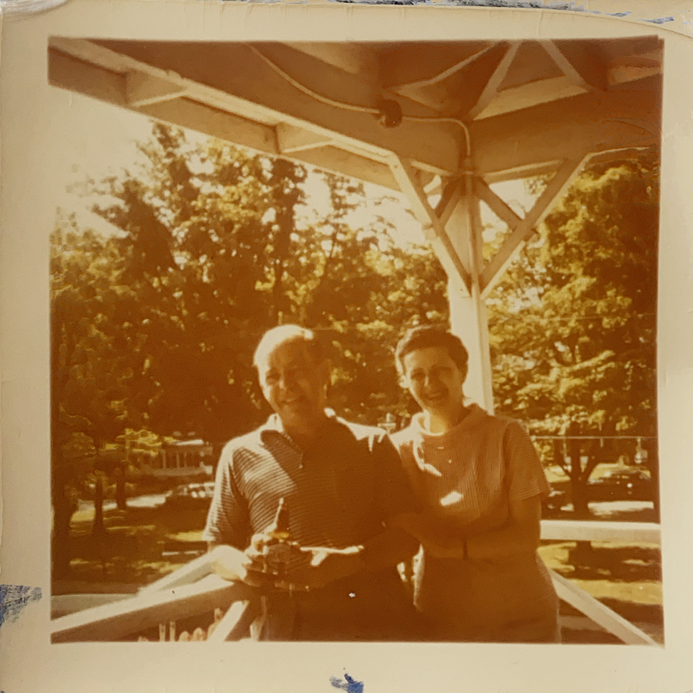

D’aussi loin que vont les souvenirs, [Auréa](https://cgermain97.github.io/Feu-de-Foret/aur%C3%A9a/) fut toujours très coquette. Elle portait un grand un soin à son apparence. Un mois avant sa mort, elle se rendit chez son avocat pour les
dernières modifications de son testament. Avant de partir elle se maquilla, appliqua du rouge à lèvres sur sa bouche ridée, mit du fard à paupières, s’assura que la mise en plis de ses éternels cheveux blonds était impeccable, s’arma de sa bonbonne d’oxygène et s’en alla faire la belle dans son bureau. Pour Auréa, il n’y avait pas d’âge pour charmer les messieurs fortunés. 

***

La femme de Joe mourut au début des années 60. Auréa et lui entretenant
déjà une relation adultère, décidèrent de célébrer leur mariage en 1963. Auréa changea alors son nom et prit celui de Joe. Cette année marqua leur premier voyage à [Vilélie](https://cgermain97.github.io/Feu-de-Foret/intro/). Lors de ce voyage, ils empruntèrent l'autoroute pour se rendre à New York, la destination pour leur lune de miel. Cette autoroute, reconvertie en route, traverse encore à ce jour Vilélie. C'est à ce moment qu'ils firent la connaissance de Charles. Tout comme Joe, il faisait lui aussi fortune dans l’industrie du bois. Cela ne prit qu'une visite pour que Joe soit charmé par les perspectives économiques de la ville et celles d'une relation avec Charles. [Auréa](https://cgermain97.github.io/Feu-de-Foret/aur%C3%A9a/), elle, tomba en amour avec la beauté de l'endroit. Les deux hommes se lièrent vite d’amitié, et leurs deux femmes aussi. Ils devinrent un quatuor inséparable. Après leur voyage de noces, Auréa et Joe continuèrent de visiter régulièrement Vilélie, les quatre amis fêtaient beaucoup, allèrent dans des soirées, des spectacles ou pêchèrent dans la rivière qui traversait la ville. C'est à cette époque qu'Auréa fit l'acquisition de la [maison triangle](https://cgermain97.github.io/Feu-de-Foret/triangle/), l'utilisant lors de leurs séjours et invitant souvent son [frère](https://cgermain97.github.io/Feu-de-Foret/hubert/) et Philie. 

Le couple vivait très confortablement grâce à l’argent que faisait Joe avec sa compagnie. Il gagnait encore plus, maintenant qu’il
importait du bois depuis Vilélie. Auréa arrêta de travailler et profita de la vie avec Joe. Elle s’occupa de ses
trois enfants, mais n’en ayant jamais désiré, elle ne fut pas la meilleure figure maternelle. De toute manière,
comme elle avait une grande différence d’âge avec Joe, les enfants arrivaient alors à la fin de leur
adolescence et au début de leur vie adulte. À la mort de Joe, le plus vieux avait déjà quitté la maison et fondé
une famille. 

Joe mourut en 1967, après seulement 4 ans de mariage. Les rumeurs racontent qu'[Auréa](https://cgermain97.github.io/Feu-de-Foret/aur%C3%A9a/) y joua un rôle. Dans la version officielle, une crise cardiaque
l’emporta, âgé alors d’une cinquantaine d’années. Évidemment, il fumait et buvait beaucoup, mais qui sait ce qu'Auréa aurait pu faire pour aider? Peut-être pensa-telle hériter de son argent et vivre doucement et confortablement pour
le reste de ses jours? Cependant, la famille de Joe avait d'autres plans pour Auréa. Était-ce le résultat d'une manipulation? Nous ne le saurons jamais. Auréa n'hérita de rien. Refusant d’être laissée ainsi, Auréa s’enfuit dans la nuit, emportant avec elle la trentaine de peintures que possédait Joe, qui disait-on, valaient une vraie fortune. Elle les a toujours
cachées, refusant aussi de revoir les membres de la famille de son défunt époux. Ce n’est qu’au début des années 2000, lorsqu’elle se fit construire sa nouvelle et énorme maison de retraite à [Vilélie](https://cgermain97.github.io/Feu-de-Foret/intro/), qu'elle les étala sur tous les murs. 

*À ce jour la seule photo qu'on ait jamais retrouvé de Joe et Auréa*