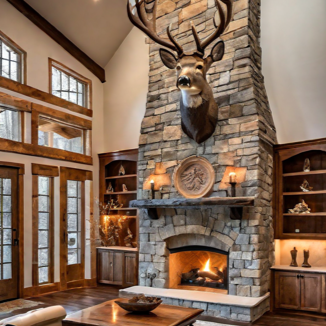

Cette maison est la première qu'acheta [Auréa](https://cgermain97.github.io/Feu-de-Foret/aur%C3%A9a/) à [Vilélie](https://cgermain97.github.io/Feu-de-Foret/post1/). Elle se situe juste un peu à l'extérieur du centre ville. Lorsqu'on traverse la route passante, on fait face à la rivière et à un pont fait d'énormes billots de bois et de fer qui permet de traverser. La maison est entourée d'arbres verts et beaucoup de pins, dont les aiguilles ont créées un tapis sur le sol menant à l'entrée. Comme son nom l'indique, la maison au toit vert est en forme de triangle, le toit touchant presque le sol de chaque côté. Les murs extérieurs sont peints blancs, tout comme ceux à l'intérieur. Quand on entre, on est confronté à l'énorme foyer dans la pièce principale, au-dessus duquel trône une tête de chevreuil, tué dans un accident de voiture, alors qu'Auréa elle-même était au volant. Malgré cette pièce imposante, le reste de la maison est plutôt petit, au fond, une mezzanine mène à une petite chambre d'invités avec des plafonds bas et pentus. Une peau d'ours, la tête toujours attachée, décore le sol entre deux lits incorfortables. En bas, la minuscule cuisine, une salle de bain et deux chambres complètent l'ensemble. 

Elle y amena souvent Hubert et sa femme. Ils prenaient plusieurs bouteilles de
vin et descendaient en maillot dans la rivière qui faisait face à la maison. Ils se
saoulaient et finissaient la soirée en jouant aux cartes. C'est comme cela qu'Auréa les introduisit à Charles
et sa femme. Tous ensemble, ils buvaient et fumaient en toutes occasions dans la maison triangle. 

Auréa garda cette maison jusqu'aux début des années 2000, après avoir fait construire sa nouvelle et énorme maison de retraite. 
Elle ne cessa d'en parler, se remémorant ses soiées inouabliables, où seule la joie teintait l'air.